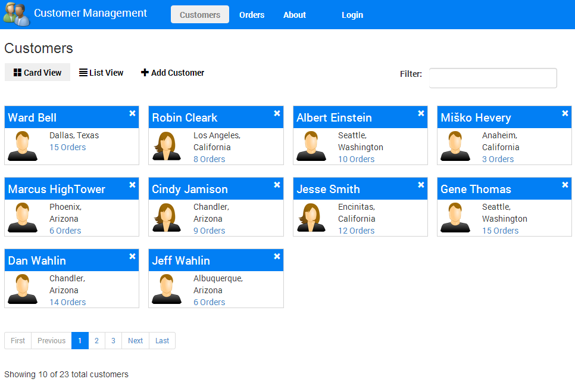

Customer Manager with AngularJS
===============

This application demonstrates:

* A complete application with read-only and editable data
* Using AngularJS with $http in a factory to access a backend RESTful service
* Using BreezeJS in a factory to access a backend RESTful Service
* Techniques for showing multiple views of data (card view and list view)
* Custom filters for filtering customer and product data
* A custom directive to ensure unique values in a form for email 
* A custom directive that intercepts $http and jQuery XHR requests (in case either are used) and displays a loading dialog
* A custom directive that handles highlighting menu items automatically based upon the path navigated to by the user
* Form validation using AngularJS
* Provides login and authentication functionality (currently client-side only - plan to add server-side part too which is absolutely required in a "real" app)

The factories can be switched by changing the app/customersApp/services/config useBreeze setting to true.

The AngularJS portion of the app is structured using the following folders:

github.com/bbaia) for the contribution
